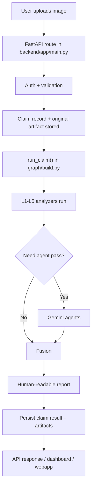
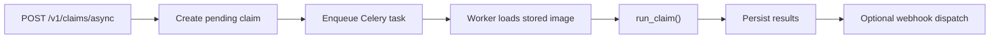

# Data Flow

This document explains what happens in TruthPixel from the moment an image enters the system
until a final report comes out.

## High-level flow

## 1. Entry points

Main entry points are in:

- `backend/app/main.py`

Important routes:

- `POST /v1/claims`
- `POST /v1/claims/async`
- `GET /v1/claims`
- `GET /v1/claims/{claim_id}`
- `POST /v1/claims/{claim_id}/decision`
- `GET /v1/claims/{claim_id}/audit`

### Sync route

`POST /v1/claims`

This does:

1. validate auth
2. validate image type/size
3. build `ClaimContext`
4. create a claim record
5. store original image artifact
6. run the full analysis pipeline
7. persist artifacts and final result
8. return `StoredClaim`

### Async route

`POST /v1/claims/async`

This does:

1. validate auth
2. store claim and original artifact
3. enqueue a background job
4. return queue status immediately

## 2. Auth and validation

Auth happens through:

- `backend/app/auth.py`

Possible modes:

- local-dev bypass
- tenant API key
- public anonymous submission
- public signed-in user submission via Supabase token

Input validation includes:

- content type
- file size
- missing image bytes

## 3. Claim creation

Before running analysis, the backend stores initial state:

- claim metadata in database
- original image in artifact storage

Why this matters:

- even failed claims can still be audited
- async jobs can continue later
- artifacts can be shown in dashboard/webapp

## 4. Runtime orchestrator

The main pipeline is:

- `backend/app/graph/build.py`

This is the real "engine room" of the application.

It builds a LangGraph flow with these nodes:

1. analyzers
2. agents
3. fusion
4. report

## 5. Analyzer stage

Analyzer stage runs five layers in parallel:

- L1 AI generation
- L2 forensics
- L3 recapture
- L4 metadata
- L5 context

Each analyzer returns a `SignalResult` with:

- layer name
- score
- confidence
- evidence
- error, if any
- model version

Important design rule:

- one analyzer failing must not kill the whole claim

That is why the `Analyzer` base class returns structured errors instead of letting exceptions
break the pipeline.

## 6. Conditional agent routing

After analyzers run, the system decides whether agents should be called.

This happens in:

- `route_after_analyzers()` in `backend/app/graph/build.py`

Agent pass runs only when:

- risk is uncertain
- or recapture is strongly flagged

Why:

- save cost
- keep latency lower
- only use Gemini when it can change the decision

## 7. Agent stage

When enabled, two agent modules run:

- semantic inspector
- damage plausibility

These are not replacements for analyzers.

They add extra reasoning signals that are hard to express with only deterministic detectors.

## 8. Fusion stage

Fusion happens in:

- `backend/app/fusion/engine.py`

Fusion combines:

- analyzer outputs
- agent outputs

Current runtime behavior:

- if a learned fusion artifact is configured, use it
- otherwise use weighted fusion fallback

Output:

- one risk score
- one `needs_review` boolean
- contribution breakdown

## 9. Report stage

Report writing converts technical outputs into reviewer-readable text.

This is important because the product is not only scoring an image. It is also helping a
human understand why the claim is suspicious or less suspicious.

## 10. Artifact persistence

After analysis:

- heatmaps may be persisted
- stored claim is updated
- audit records are appended

This enables:

- dashboard review
- public webapp display
- future training export
- legal/audit trace

## 11. Where data is stored

### Structured data

Stored in database:

- claims
- audit events
- API keys
- tenants
- usage summaries
- artifact metadata

### Binary artifact data

Stored in artifact backend:

- original upload
- heatmap images

Storage backend may be:

- local disk
- S3-compatible object storage

## 12. What the frontend sees

The frontend does not run models.

It only consumes stored results through backend APIs:

- webapp calls `POST /v1/claims`
- dashboard calls list/detail/decision/audit/artifact routes

This is a very important architectural rule:

- frontend renders
- backend decides

## 13. Async flow details

Async flow adds another step:

This exists because some enterprise integrations prefer:

- immediate ack
- polling later
- webhook callback

## 14. What to read in code for each step

| Step | Main file |
|---|---|
| API entry | `backend/app/main.py` |
| Auth | `backend/app/auth.py` |
| Config/env | `backend/app/config.py` |
| Pipeline graph | `backend/app/graph/build.py` |
| Signals | `backend/app/analyzers/` |
| Fusion | `backend/app/fusion/engine.py` |
| Report/agents | `backend/app/agents/` |
| Storage | `backend/app/storage/repository.py` |
| Artifact handling | `backend/app/artifacts.py`, `backend/app/signal_artifacts.py` |
| Async jobs | `backend/app/jobs.py`, `backend/app/celery_app.py` |

## 15. The most important lesson

TruthPixel is not "upload image -> one model -> answer."

It is:

- upload
- validate
- persist
- run many signals
- optionally reason with agents
- fuse
- persist
- present to humans

Understanding that full chain is the key to understanding the whole project.
